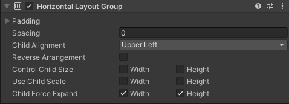

# Tower Defense

## Development Day 1: 2023.12.22

1. 在制作游戏时的便利方法，可以用来在开发模式下直接描绘出武器范围：

   ```
       private void OnDrawGizmosSelected()
       {
           Gizmos.color = Color.red;
           Gizmos.DrawWireSphere(transform.position, range);
       }
   ```

2. `OnTriggerEnter`执行条件有三个：

   1、两个物体都必须有碰撞器（`Collider`）组件；

   2、其中一个物体的碰撞器（`Collider`）的`IsTrigger`属性必须勾上；

   3、**最重要的一点，其中一个物体必须有刚体（`Rigidbody`）组件。如果是一个运动的物体（如子弹）去碰撞一个静止的物体，则刚体（`Rigidbody`）组件必须加在运动的物体上，否则无法触发`OnOnTriggerEnter`函数。所以这时候子弹身上就要加一个`Rigidboyd`而不是`character controller`；**

3. `Unity`的`Horizontal Layout Group`可以帮助快速进行网格排版：

   

4. `Line Renderer`：制作`Laser Beamer`武器的时候用到的，效果就是画条线，调整调整可以做激光。

5. `Script Execution Order`：可以在`Edit->Project Setting->Script Execution Order`当中找到，当两个脚本的运行顺序非常必要时，可以通过这个方式来规定两个脚本运行的先后顺序。避免出现意外情况。

   


小小打算：

1. 死亡金币的回馈是与被攻击的次数有关（被攻击的次数越多获得金币越多）；
2. 敌人的血量会随着放置的武器数量而增加；
3. 当血量上升到特定值时，敌人将拥有破坏武器的能力。